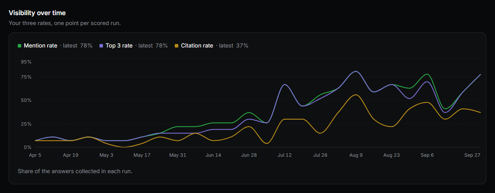
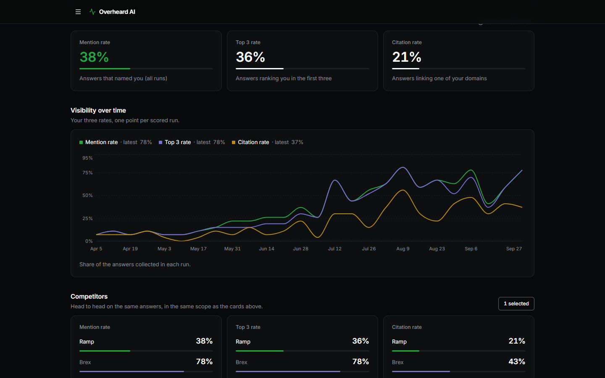
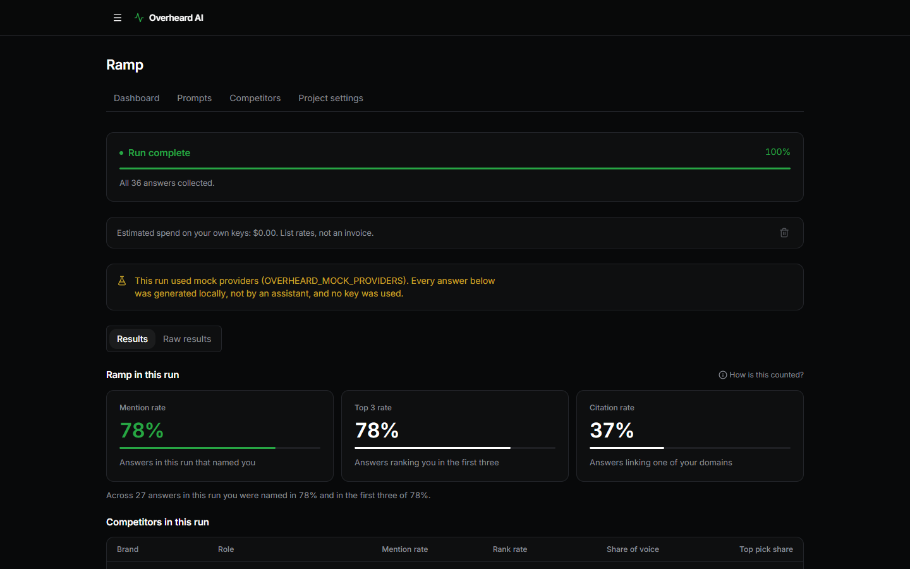
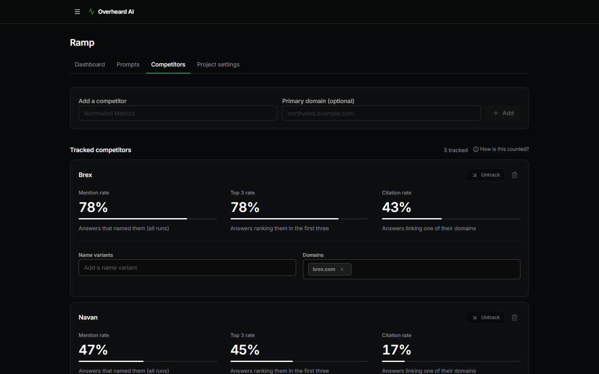
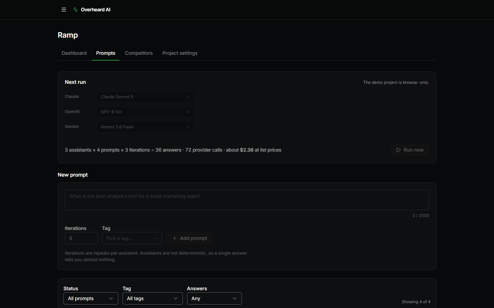

<div align="center">

# Overheard AI

**See what ChatGPT, Claude and Gemini say about your brand, measured on your own machine.**

[](https://github.com/TrellaceTeam/overheard-ai/actions/workflows/ci.yml)
[](LICENSE)
[](.node-version)
[](#production-and-bun)



</div>

A buyer needs to make a purchase so they open an AI chat and ask for recommendations. The AI comes back with four companies, each with their pros and cons, ultimately recommending one for them. The buyer reaches out... 

More purchases start this way now. In [G2's 2026 survey][g2] of over 1,000 software buyers, 51% said they begin research in an AI chatbot more often than in Google, up from 29% in April 2025. Sixty-nine percent chose a different vendor than they'd planned based on a chatbot's guidance, and a third bought from a vendor they'd never heard of. 

For startups, this is an opening. It also raises the question we kept hearing from founders: how can we track what AI saying about us? 

We built Overheard AI to answer that question and we've released it free and open source.

It runs on your machine with your AI accounts and every answer lands in one SQLite file you
own. There is no sign up, no credit card, and no telemetry.

## Quickstart

You need Node 22.13 or newer.

```sh
git clone https://github.com/TrellaceTeam/overheard-ai.git
cd overheard-ai
npm install
cp .env.example .env        # then paste at least one API key into .env
npm run dev
```

In Windows PowerShell, type `npm.cmd` wherever this page says `npm`. PowerShell's default
execution policy refuses to run `npm`.

Open http://127.0.0.1:3000.

No key yet? Start it anyway. The first launch walks you through a demo project with six months of
generated history. It makes no API calls and costs nothing.

### Or hand it to a coding agent

Paste this into Claude Code, Codex, Cursor or any agent that can run a terminal:

```text
Set up Overheard AI (https://github.com/TrellaceTeam/overheard-ai) on this machine.
In Windows PowerShell, run npm.cmd wherever these steps say npm.
1. Run `node --version`. If it is older than 22.13, stop and tell me.
2. git clone https://github.com/TrellaceTeam/overheard-ai.git, then cd overheard-ai
3. npm install
4. Copy .env.example to .env. Leave every key empty: I will add mine myself.
5. Start `npm run dev` in the background, since it keeps running. Tell me the address it prints.
Never write an API key into a file, a command or a message. If a step fails, show me the
error and stop.
```

The agent never handles a key. You paste yours into `.env`, and the app picks it up without a
restart.

## What it measures

| Number | Share of answers that |
| --- | --- |
| Mention rate | name your brand |
| Top 3 rate | put you in the first three places of a ranked list |
| Citation rate | link one of your domains |

Share of voice divides your mentions by the mentions of every brand in the same answers,
including brands you don't track yet. The competitor table shows it for you and each
competitor, next to rank rate and top pick share. A perception summary says what the
assistants think you do, who buys from you, and what people praise and complain about.

A few rules decide what counts. An answer counts at most one mention per brand, so a chatty
model can't outscore a decisive one. Failed calls are shown but never enter a rate. A prompt
that names your own brand, like "Is Acme any good?", is kept but
[never counted](docs/decisions/0005-self-referenced-prompts-never-count.md), because its answers
almost always mention you. CI checks the scoring code against fixtures generated by a
[reference implementation](docs/architecture.md#finalisation-and-the-oracle-fixtures) in
PL/pgSQL, run inside an embedded Postgres.

| Dashboard | Finished run |
| --- | --- |
|  |  |
| **Competitors** | **Prompts and the Runner** |
|  |  |

The screenshots show the built-in demo project. Its history is generated, so none of it is a
measurement of Ramp or its competitors.

## Keys

One key is enough. Overheard AI only calls providers you have a key for. It reads `.env` again
whenever it looks up a key, so a key you add or change there needs no restart. A key set in
your shell wins over the file.

| Provider | Variable in `.env` | Assistants | Extraction model |
| --- | --- | --- | --- |
| [OpenAI](https://platform.openai.com/api-keys) | `OPENAI_API_KEY` | `gpt-6-astra`<br>`gpt-6.1-sol` | `gpt-6-luna` |
| [Anthropic](https://console.anthropic.com/settings/keys) | `ANTHROPIC_API_KEY` | `claude-opus-5-5`<br>`claude-sonnet-5-5` | `claude-haiku-4-5` |
| [Google](https://aistudio.google.com/apikey) | `GOOGLE_API_KEY`<br>or `GEMINI_API_KEY` | `gemini-3.1-pro-preview`<br>`gemini-3.8-flash` | `gemini-3.5-flash-lite` |

The list only holds models checked against a run's request. Every answer has to come from a
web search, and each provider's models differ in what a request may ask of them. When a
newer model replaces one, the older one stays for the projects already asking it, so their
trends keep comparing the same model, and new projects start on the newer one.

Before it creates a project, the setup screen runs a setup check. It makes one short call to
each assistant you picked, with web search forced, and one to the extraction model. A bad key,
missing billing or an unavailable model shows up there with the reason and a fix. The calls
are real and billed to your keys, but short. Gemini's free tier fails the check, because every
answer has to search. `npm run check:search` runs the same probe from a terminal.

Each key's model list is read from the provider too, for free. The key panel says which
models your key can use, and the setup screen will not tick one it cannot.

`.env.example` lists the other settings: the database path, the port, and how many calls each
provider may have in flight.

## What a run costs

Each answer takes two calls. One asks the prompt. The other, to a cheaper extraction model,
reads the answer back into brands, ranks and links.

```
answers = (sum of iterations over the active prompts) x assistants
calls   = answers x 2
```

A project's first run also asks each assistant a perception prompt once. The Runner on the
Prompts tab shows the planned calls and an estimated cost before you confirm, and refuses any
plan above the run size limit in Account settings, 1,000 calls by default.

The estimate can run low. It assumes a typical number of web searches per answer, and only
Anthropic caps them. The run page adds up each call's cost from its real token counts at list
prices. Your provider's dashboard has the final word.

## Your data

Everything lives in `./data/overheard.db`, next to its `-wal` and `-shm` files.
`DATABASE_PATH` moves it, and `data/` is gitignored. To back it up while the app runs:

```sh
sqlite3 ./data/overheard.db ".backup ./backup/overheard.db"
```

Or stop the app and copy all three files. To upgrade, run `git pull` and `npm install`, then
restart. Migrations run at start and only move forward, so back up before a big upgrade.

Run one Overheard AI process per database file. Two processes would claim the same tasks and
pay for the same answers twice.

## Security

- Both `npm run dev` and `npm start` bind to `127.0.0.1`. The server refuses a request whose
  `Host` isn't this machine and a cross-site request that changes data, and no page can be
  framed.
- Keys stay on the server. They never reach the browser, the database or a log, and the app
  never writes to `.env`.
- The only outbound traffic goes to the providers you have keys for.
- There is no login. Anyone who can reach the port can read every answer and spend your keys,
  so don't put it on a public address.

Report a vulnerability through
[private vulnerability reporting](https://github.com/TrellaceTeam/overheard-ai/security/advisories/new),
not a public issue.

## How it works

It's a TanStack Start app running as one process. A worker loop inside the web server sends
each prompt to each assistant and stores every answer in full. A second call reads each answer
into brands, positions and links, in a schema the request enforces. When a run finishes, it
is scored per assistant and prompt, and brands you don't track show up as discovered
competitors.

There is no queue server or background service. Close the app and everything stops. Start it
again and an interrupted run picks up where it left off, without buying answers it already
stored. SQLite ships inside Node 22.13+ and Bun, so there is
[nothing native to compile](docs/decisions/0001-runtime-and-sqlite-driver.md).

Schedules run on a second timer in the same process. A project can run daily, weekly or
monthly, but only while Overheard AI is running. A run missed while the app was closed happens once at the next launch.

[docs/architecture.md](docs/architecture.md) covers the schema, the run state machine,
recovery and the scoring fixtures.

### Production and Bun

```sh
npm run build
npm start              # Node, reads .env if present
npm run start:bun      # or Bun
```

Both serve the same `dist/` on the same address. The boot line says which SQLite driver it
picked. `npm run test:bun` runs the tests under Bun.

## Known limitations

- It asks the APIs, not the apps. Answers come from each provider's API with web search on,
  which is close to what people see in ChatGPT, Claude or Gemini, but not the same.
- Gemini, Claude Opus 5.5 and Claude Sonnet 5.5 can't be forced to search, so they are told
  to. An answer with
  no search is retried, then counted as failed, and you still pay for the call.
- Stopping the app mid-run can repeat up to 15 calls, the ones in flight when it stopped.
- Node 22 and 24 print `ExperimentalWarning: SQLite is an experimental feature` at boot. It is
  harmless. Node 25 and Bun don't print it.

## Roadmap

[Left out of v1 on purpose](docs/decisions/0004-v1-scope.md): a backup export button, a theme
switcher, a diagnostics page, OpenRouter support and report sharing.

## Contributing

Bug reports and pull requests are welcome. [CONTRIBUTING.md](CONTRIBUTING.md) covers setup, the
four checks CI runs, and the one rule about test data: fictional brands only.

## From Trellace

[Trellace][trellace] works with B2B founders in the messy middle, after product-market fit and
before a repeatable go-to-market team. That's usually $1 million to $10 million in annual
revenue. We publish the methods and tools we use because GTM needs more open source projects.

- **Founders.** If you'd like help reading what the assistants say about you, or deciding what
  to change, [book a 30-minute GTM Sparring Session][contact].
- **Investors.** Most of our work starts with an introduction from a fund. If a company you
  back comes to mind, [make an introduction][contact].
- **More free tools.** See everything we've published at
  [github.com/TrellaceTeam](https://github.com/TrellaceTeam).

[trellace]: https://www.trellace.com/?utm_source=github&utm_medium=readme&utm_campaign=overheard-ai
[contact]: https://www.trellace.com/contact?utm_source=github&utm_medium=readme&utm_campaign=overheard-ai

## License

MIT. See [LICENSE](LICENSE).

Built by Trellace. If you run it somewhere other people use it, please keep the "Built by
Trellace" line in the app's menu. The license doesn't require it. We'd just like the credit.
